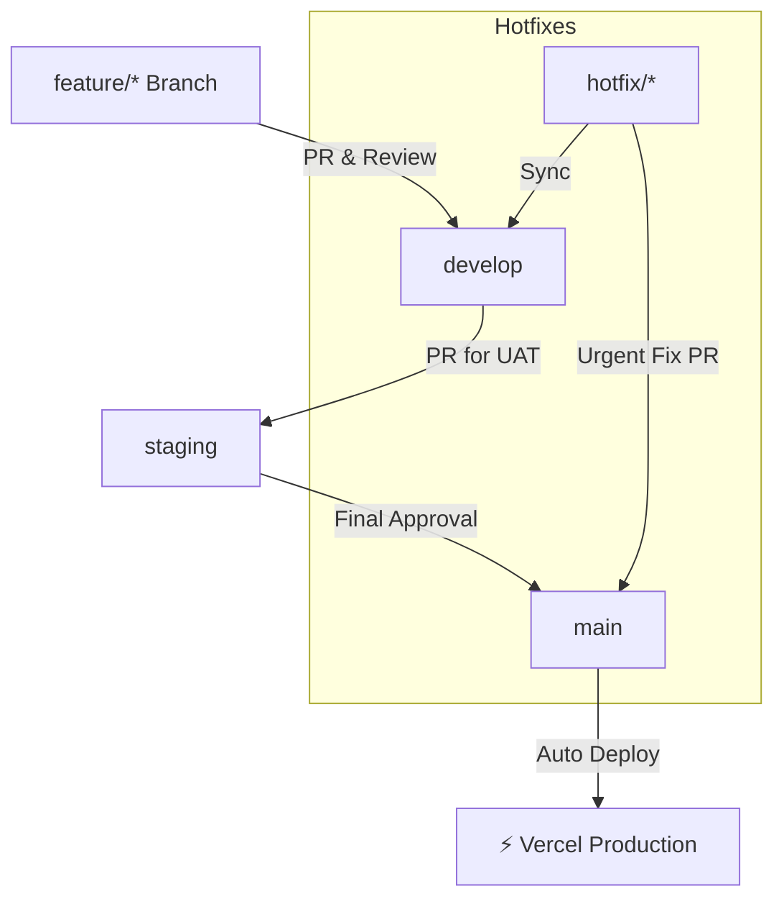

# Branching Strategy — Vishwakarma Nexus

Adapted from GitFlow principles, simplified for a small, fast-moving web project built by a lean team.

---

## 1. Core Branches

| Branch | Purpose | Stability |
|---|---|---|
| `main` | Live production site — always deployable | 🟢 Stable |
| `develop` | Active integration branch for feature works | 🟡 Mostly stable |

> [!CAUTION]
> **NEVER** commit directly to `main`. All changes must come via Pull Request.

---

## 2. Feature Branches

All new work is done in dedicated feature branches.

**Naming Convention:**
```
feature/<type>/<short-description>
```

- `<type>`: `feat`, `fix`, `refactor`, `chore`, `docs`
- `<short-description>`: Concise, kebab-case

**Examples:**
- `feature/feat/hero-five-sons-section`
- `feature/feat/digital-id-card`
- `feature/fix/supabase-cors`
- `feature/chore/seo-meta-tags`

**Workflow:**
1. Branch from `develop`.
2. Implement, test locally (`npm run dev`).
3. Open PR → merge into `develop`.
4. Delete the feature branch after merge.

---

## 3. Release Flow

Since VKC deploys to Vercel/Cloudflare and doesn't need complex staging pipelines, releases are lean:

```
develop → staging → main
```

- **`staging`**: A branch auto-deployed to a Vercel Preview URL for review/UAT.
- **`main`**: Auto-deployed to production. Tagged with version (e.g., `v1.1.0`).

**Workflow:**
1. Feature branches → merged into `develop`.
2. `develop` → PR into `staging` for final visual review.
3. `staging` → PR into `main` → production deploy.
4. Tag the release in `main`.

---

## 4. Hotfix Branches

For urgent production bugs (e.g., Supabase CORS, broken build).

**Naming Convention:**
```
hotfix/<short-description>
```

**Workflow:**
```bash
# 1. Create hotfix from main
git checkout main
git pull origin main
git checkout -b hotfix/fix-supabase-cors

# 2. Fix the bug & commit
git add .
git commit -m "fix: resolve supabase cors on production"

# 3. Merge to main (via PR)
git push origin hotfix/fix-supabase-cors

# 4. Sync develop
git checkout develop
git merge hotfix/fix-supabase-cors
git push origin develop

# 5. Delete hotfix branch
git branch -d hotfix/fix-supabase-cors
```

---

## 5. Visual Workflow



---

## 6. Best Practices

- **Commit Messages**: Use [Conventional Commits](https://www.conventionalcommits.org/) (`feat:`, `fix:`, `docs:`, `chore:`).
- **PR Reviews**: At least one approval before merging to `develop` or `main`.
- **Branch Lifespan**: Feature branches should be short-lived (< 1 week). Merge and delete promptly.
- **Environment Variables**: Never commit `.env` — use Vercel's dashboard for secrets.
- **Docs Updates**: Any UI/UX or architecture change should update the relevant file in `docs/`.
