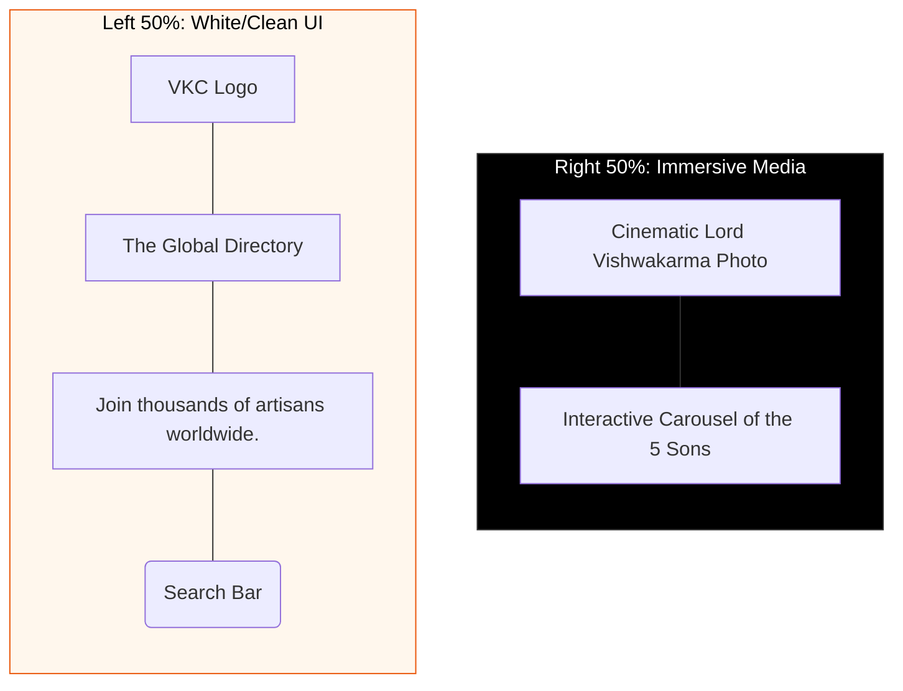
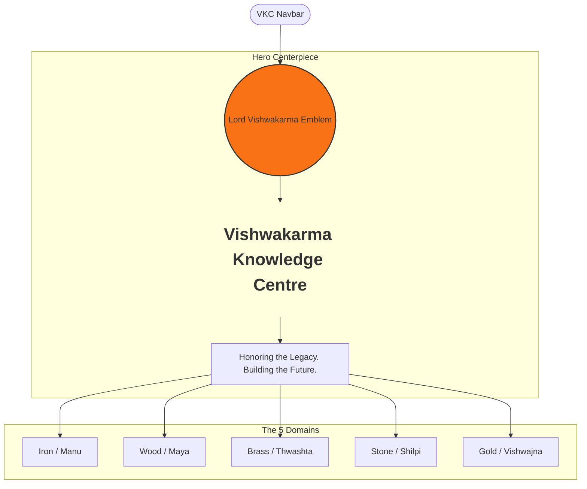

# UX Strategy: Transitioning Hero from "Mythological" to "Knowledge Centre"

While the grand, glowing image of Lord Vishwakarma is aesthetically beautiful, it currently dominates the visual hierarchy, causing the platform to look more like a religious or mythological site rather than an active, professional **Knowledge Centre (VKC)**. 

To pivot the identity while maintaining respect for the heritage, we must treat Lord Vishwakarma as the **institutional foundation** rather than a character portrait.

Here are 3 UX prototypes using our official `Saffron` (#f97316) and `Gold` (#eab308) themes.

---

## Prototype 1: "The Institutional Watermark" (Recommended)
**Concept**: We replace the high-contrast glowing background image with a deep, sophisticated dark background (`bg-stone-950`). Lord Vishwakarma is converted into an ultra-minimal, low-opacity **gold linework/watermark** anchoring the right or center. This brings extreme clarity to the VKC typography.

*   **Colors**: Deep `stone-950` base, `saffron-500` accents.
*   **Typography**: Massive, bold, left-aligned sans-serif.

```mermaid
flowchart TB
    subgraph TopNav [Navigation Bar]
        logo[VKC Logo] ~~~ links["Home | Directory | Heritage"]
    end
    
    subgraph Hero [Main Hero Area]
        direction LR
        subgraph Left [Brand Context]
            T1[VISHWAKARMA]
            T2[KNOWLEDGE CENTRE]
            T3[Preserving the Divine Crafts]
            BTN(Explore Directory)
            T1 --- T2 --- T3 --- BTN
        end
        
        subgraph Right [Background Watermark]
            IMG[Subtle Gold Linework of Lord Vishwakarma<br/>Opacity: 10%]
        end
        Left ~~~ Right
    end
    
    subgraph InteractiveCarousel [The 5 Pillars Docked at Bottom]
        direction LR
        S1[Manu] ~~~ S2[Maya] ~~~ S3[Thwashta] ~~~ S4[Shilpi] ~~~ S5[Vishwajna]
    end
    
    TopNav --- Hero --- InteractiveCarousel
    
    style Left fill:none,stroke:none
    style Right fill:none,stroke:none
    style TopNav fill:#1a1a1a,stroke:#333
    style Hero fill:#0a0a0a,stroke:#333
    style InteractiveCarousel fill:#1a1a1a,stroke:#f97316
```

---

## Prototype 2: "The Blueprint / Forge Split"
**Concept**: We visually divide the screen. The left side is a stark, clean interface focusing on the intellectual aspect of the Knowledge Centre (directory, education). The right side is an immersive, high-quality carousel of the 5 Sons and the heritage.

*   **Colors**: Left: `saffron-50` (Very light, clean UI). Right: `black` (Immersive media).
*   **Typography**: High contrast dark-on-light for maximum professional legibility.

---

## Prototype 3: "The Golden Pillar Deck"
**Concept**: Instead of a full-screen image, the hero is centered around a massive elevated "Card" or "Deck" that introduces VKC. Lord Vishwakarma sits at the absolute pinnacle (top center) like a crest/emblem, rather than the entire background.

*   **Colors**: `saffron-900` deep gradients.
*   **Visuals**: The 5 Sons are presented as 5 golden architectural pillars that the user can click to route into the site.

---

### UX Engineer's Verdict
I strongly recommend **Prototype 1**. It maintains the stunning interactive orbital carousel we just refined but shifts the background from an overpowering portrait to an elegant, sophisticated watermark. This immediately elevates the platform from a "mythology blog" to a "premium professional organization."
